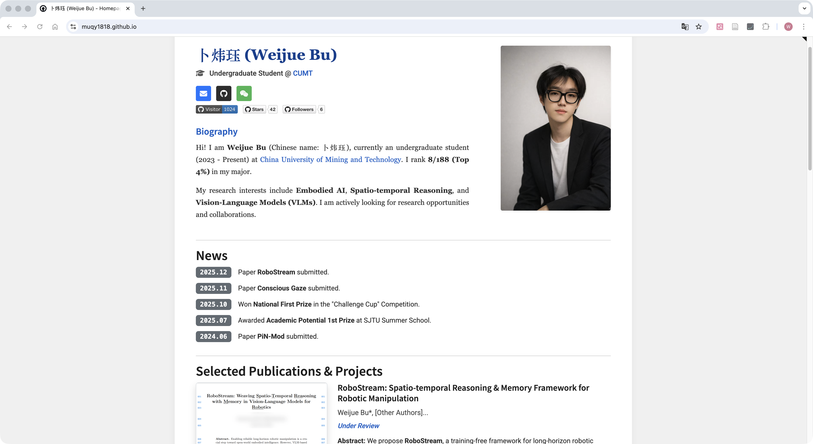

# Weijue Bu's Academic Homepage

[](https://muqy1818.github.io/)
[](LICENSE)
[](https://github.com/muqy1818/muqy1818.github.io/graphs/commit-activity)

A modern, responsive academic personal website showcasing research, publications, and achievements.

## 🌟 Features

- **Modern Design**: Clean, professional layout with gradient backgrounds and smooth animations
- **Responsive**: Fully responsive design that works on all devices
- **Easy to Update**: Content managed through simple Markdown files
- **Local Preview**: Built-in development server for real-time preview
- **Fast Loading**: Optimized CSS and JavaScript for quick page loads
- **Professional Sections**: Home, Research Experience, Publications, and Awards
- **Math Support**: LaTeX formula rendering with MathJax
- **Badge Integration**: Support for GitHub shields and custom badges

## 🚀 Live Demo

Visit the live website: [https://muqy1818.github.io/](https://muqy1818.github.io/)

## 📸 Preview
[](https://muqy1818.github.io/)


## 🚀 Quick Start

### Local Development

1. **Clone the repository**:
   ```bash
   git clone https://github.com/muqy1818/muqy1818.github.io.git
   cd muqy1818.github.io
   ```

2. **Start local preview**:
   - **Option 1**: Double-click `start_preview.bat` (Windows)
   - **Option 2**: Run `python start_server.py` in terminal

3. **Open in browser**: The website will automatically open at `http://localhost:8000`

4. **Edit content**: Modify files in the `contents/` folder and refresh browser to see changes

### Content Management

All content is managed through Markdown files in the `contents/` folder:

- `config.yml` - Site configuration (title, name, etc.)
- `home.md` - Personal introduction and basic information
- `research.md` - Detailed research experience and projects
- `publications.md` - Research publications and papers
- `awards.md` - Awards, honors, and achievements

### Customization

#### Update Personal Information
Edit `contents/config.yml`:
```yaml
title: Your Name's Homepage
page-top-title: Your Name
top-section-bg-text: Your Field
home-subtitle: Your Name&ensp;|&ensp;中文名
copyright-text: '&copy; Your Name 2024-2025. All Rights Reserved.'
```

#### Add/Update Content
Simply edit the corresponding `.md` files in the `contents/` folder. The site supports:
- Markdown formatting
- HTML elements
- Emoji icons
- Badge images (shields.io)
- Mathematical equations (MathJax)

#### Styling
- Main styles: `static/css/main.css`
- Bootstrap theme: `static/css/styles.css`

## 📁 Project Structure

```
├── contents/           # Content files
│   ├── config.yml     # Site configuration
│   ├── home.md        # Home page content
│   ├── research.md    # Research experience
│   ├── publications.md # Publications
│   └── awards.md      # Awards and honors
├── static/            # Static assets
│   ├── css/          # Stylesheets
│   ├── js/           # JavaScript files
│   └── assets/       # Images and other assets
├── index.html         # Main HTML file
├── start_server.py    # Local development server
└── start_preview.bat  # Windows batch file for easy startup
```

## 🎨 Design Features

- **Modern Gradient Backgrounds**: Eye-catching color schemes
- **Smooth Animations**: Hover effects and transitions
- **Professional Typography**: Clean, readable fonts
- **Card-based Layout**: Organized content presentation
- **Mobile-First Design**: Optimized for all screen sizes

## 🔧 Technical Stack

- **Frontend**: HTML5, CSS3, JavaScript (ES6+)
- **Framework**: Bootstrap 5
- **Content**: Markdown with YAML configuration
- **Math Rendering**: MathJax
- **Development**: Python HTTP server for local preview


## 📝 License

This project is licensed under the MIT License - see the [LICENSE](LICENSE) file for details.

## 🤝 Contributing

Feel free to fork this project and customize it for your own academic homepage!

## 📧 Contact

- **Email**: weijuebu@cumt.edu.cn
- **Homepage**: https://muqy1818.github.io/
- **Blog**: https://www.muqyy.top/

## 🙏 Acknowledgments

This template is based on the original work by [Sen Li](https://github.com/senli1073/senli1073.github.io) and enhanced with modern features and improved design.
