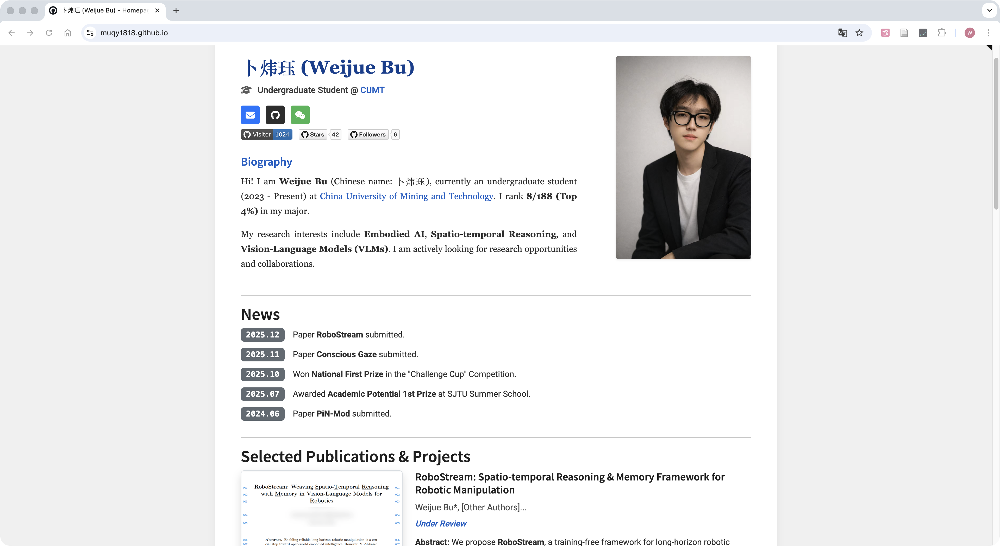

# Weijue Bu's Academic Homepage

[](https://muqy1818.github.io/)

A clean, responsive academic personal website showcasing research, publications, and achievements.  
Designed with a minimalist academic style, inspired by [Tianxing Chen's Homepage](https://tianxingchen.github.io/).

## 🌟 Features

- **Academic Layout**: Professional card-style layout with a focus on readability.
- **Responsive Design**: Adapts perfectly to mobile and desktop screens.
- **Single File**: All content is contained in `index.html` for easy maintenance.
- **Rich Content**: Supports video previews (or paper thumbnails), BibTeX, and social links.

## 🚀 Live Demo

Visit the live website: [https://muqy1818.github.io/](https://muqy1818.github.io/)

## 📸 Preview



## �️ Quick Start

### Local Development

1. **Clone the repository**:
   ```bash
   git clone https://github.com/muqy1818/muqy1818.github.io.git
   cd muqy1818.github.io
   ```

2. **Start local server**:
   You can use Python's built-in HTTP server:
   ```bash
   python3 -m http.server 8000
   ```
   Or use the provided script:
   ```bash
   python3 start_server.py
   ```

3. **Open in browser**: 
   Visit `http://localhost:8000` to see your changes.

### Customization

- **Content**: Edit `index.html` directly to update your bio, news, publications, and awards.
- **Styles**: Custom CSS is located in `static/css/academic.css`.
- **Assets**: Images and videos are stored in `static/assets/`.

## 📁 Project Structure

```
├── index.html          # Main homepage file (Edit this!)
├── static/
│   ├── css/           # Stylesheets (academic.css, etc.)
│   ├── js/            # JavaScript files
│   └── assets/        # Images, PDFs, and Videos
├── start_server.py     # Local development helper script
└── README.md           # This file
```

## 📝 License

This project is open source and available under the [MIT License](LICENSE).
